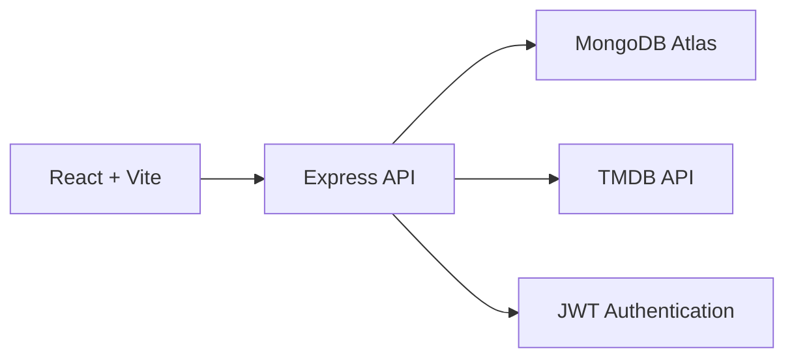

# Cinema Archive

A full-stack cinematic discovery platform combining a retro archival aesthetic with modern editorial UX.

**Status:**

```text
v1.0.0
Release Candidate / Production Ready
```

## Overview

Cinema Archive is a production-quality movie discovery platform designed for film enthusiasts. It provides an immersive experience to explore trending, popular, and top-rated films, alongside advanced search and discovery capabilities. Users can securely register accounts, maintain persistent personal watchlists, and seamlessly browse deep cinematic metadata, all wrapped in a responsive, accessible, and fast interface.

## Features

### Discovery

- Trending movies
- Popular movies
- Top-rated movies
- Genre browsing
- Year filtering
- Rating filtering
- Sort options
- Pagination

### Search

- Debounced search
- URL-synchronized queries
- Result counts
- Clear search
- Loading/error/empty states

### Movie Details

- Cinematic backdrop
- Movie metadata
- Overview
- Genres
- Cast
- Writers
- Similar movies
- Watchlist integration

### Accounts

- Register
- Login
- Logout
- Session persistence
- Protected routes

### Watchlist Feature

- Add/remove movies
- MongoDB persistence
- User-specific watchlists
- Optimistic updates
- Safe migration from legacy local storage where applicable

### UX

- Responsive layout
- Keyboard accessibility
- Reduced motion support
- Loading skeletons
- Error states
- Empty states
- Route transitions

## Design Direction

### Retro × Editorial × Cinema

**Retro:** Archival references, classic cinema personality, warm accent treatment.

**Editorial:** Strong typography, whitespace, asymmetric layouts, structured hierarchy.

**Cinema:** Large cinematic imagery, movie metadata, atmospheric backdrops.

**Primary Design Tokens:**

```text
Background: #0d0c0c
Text:       #f2efe9
Accent:     #cf663c
```

**Typography:**

- Instrument Serif
- Inter
- Space Mono

The project intentionally avoids excessive grain, sepia, vintage effects, visual clutter, and unnecessary animations in order to preserve a clean, modern experience that respects classic cinema aesthetics.

## Screenshots

Screenshots coming soon

## Tech Stack

### Frontend

- React (v19)
- Vite
- Tailwind CSS (v4)
- Framer Motion
- React Router
- Lucide React

### Backend

- Node.js
- Express
- Mongoose
- MongoDB
- JWT
- bcryptjs
- Helmet
- express-rate-limit

### External API

- TMDB

## Architecture



The browser acts strictly as a presentation layer communicating solely with the internal Express API. The browser must **NOT** communicate directly with TMDB.

**Flow:**

```text
Browser
   ↓
Cinema Archive Express API
   ├── MongoDB Atlas
   └── TMDB API
```

## Project Structure

```text
src/
├── assets/
├── components/
├── contexts/
├── data/
├── hooks/
├── pages/
├── services/
├── utils/
├── App.jsx
├── index.css
└── main.jsx

server/
├── config/
├── controllers/
├── middleware/
├── models/
├── routes/
├── services/
└── app.js
└── server.js
```

## Authentication

```text
Register
   ↓
bcrypt password hashing
   ↓
MongoDB User
   ↓
JWT
   ↓
HttpOnly cookie
   ↓
Authenticated API requests
```

- Passwords are never stored in plaintext.
- The JWT is stored in a secure HttpOnly cookie.
- The frontend does not access the JWT directly.
- Protected backend routes derive identity entirely from the authenticated request context.
- User IDs provided by the client are never trusted.

## Database

Cinema Archive uses MongoDB for data persistence.

### User Collection

```text
name
email
passwordHash
createdAt
updatedAt
```

### Watchlist Collection

```text
userId
movieId
title
poster
backdrop
rating
releaseYear
duration
```

A compound uniqueness constraint enforces a strict 1:1 mapping for `userId + movieId`, guaranteeing duplicate watchlist entries cannot occur.

## API

### Health API

```text
GET /api/health
```

### Movies API

Serves movie discovery and detail requests securely.

```text
GET /api/movies/trending
GET /api/movies/popular
GET /api/movies/top-rated
GET /api/movies/search
GET /api/movies/discover
GET /api/movies/genres
GET /api/movies/:id
```

### Authentication API

Handles account creation, login sessions, and stateless logout via HTTP cookies.

```text
POST /api/auth/register
POST /api/auth/login
POST /api/auth/logout
GET  /api/auth/me
```

### Watchlist API

Manages authenticated users' personal movie collections.

```text
GET    /api/watchlist
POST   /api/watchlist
DELETE /api/watchlist/:movieId
DELETE /api/watchlist
```

## Environment Variables

These variables must remain server-side and must never be committed. Create a `.env` file referencing `.env.example`:

```env
# Backend
TMDB_API_KEY=
MONGODB_URI=
JWT_SECRET=
JWT_EXPIRES_IN=
PORT=
NODE_ENV=
CLIENT_URL=
```

## Local Development

1. Clone the repository and install dependencies:

```bash
git clone <repository-url>
cd movie-search
npm install
```

1. Create server environment configuration by duplicating `.env.example` to `.env` and supplying your TMDB API Key, MongoDB Atlas URI, and JWT Secret.

1. Start the backend:

```bash
npm run server:dev
```

1. Start the frontend:

```bash
npm run dev
```

## Production

Build the frontend bundle:

```bash
npm run build
```

Start the production server:

```bash
npm run start
```

*Note: In production mode (`NODE_ENV=production`), the Express backend serves the built Vite application via static routing and manages all SPA history fallbacks.*

## Security

- TMDB API key remains server-side.
- MongoDB credentials remain server-side.
- JWT utilizes HttpOnly, Secure cookies to prevent XSS exfiltration.
- Passwords are encrypted utilizing robust bcrypt hashing.
- Helmet is enabled for security headers.
- CORS is rigidly configured to accepted origins.
- API rate limiting prevents brute-force abuse.
- User ownership and authorization are enforced server-side.
- Database and backend errors are sanitized before returning JSON to the client.
- `.env` files are ignored by Git.
- Client bundles contain absolutely no backend secrets.

## Performance

- Route-level code splitting via dynamic imports.
- Lazy-loaded routes and modular chunking configurations.
- Hero image prioritization (`fetchpriority="high"`).
- Lazy loading for off-screen images (`loading="lazy"`).
- Synchronized skeleton layouts mapped to explicit aspect-ratios prevent Cumulative Layout Shifts (CLS).
- AbortController integrations for clean API request cancellation upon unmounts.
- Server-side TMDB caching buffers payload sizes and shields rate limits.
- Render-blocking CSS directives mitigated, enhancing Largest Contentful Paint (LCP).

*Note: Lighthouse metrics should be collected against the deployed production URL.*

## Testing

The following flows have been thoroughly verified:

```text
MongoDB connection       PASS
Health endpoint          PASS
Registration             PASS
Login                    PASS
Session /me              PASS
Logout                   PASS
Watchlist                PASS
Production build         PASS
```

## Future Roadmap

### v1.1 (Planned)

- Recently Viewed
- Better recommendation logic
- More advanced discovery

### v1.2 (Planned)

- Custom collections
- User profile
- Personal movie statistics

### Future (Planned)

- Reviews
- Social watchlists
- Public profiles
- Personalized recommendations

## Contributing

1. Fork the repository
2. Create a feature branch
3. Make your changes and run the build (`npm run build`)
4. Test locally
5. Submit a pull request

## License

Please refer to the repository owner to select an appropriate open-source license before public distribution.
